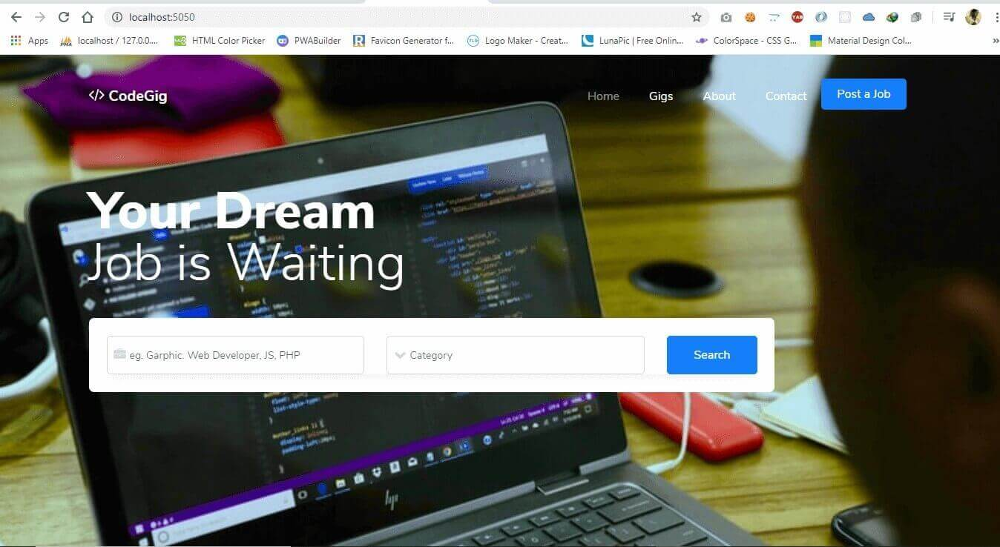
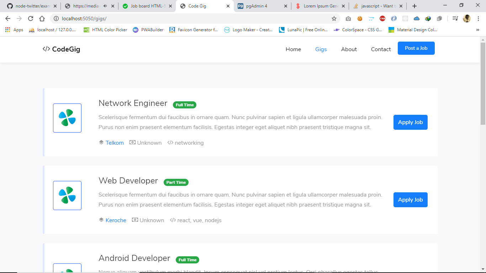

# Code Gig
> Simple Job find app for coders. This app uses Node, Express, Sequalize (Postgres) and Handlebars.





## Quick Start

``` bash
# Install dependencies
npm install

# Serve on localhost:5050
npm start
# Dev Server (Nodemon)
npm run dev
```